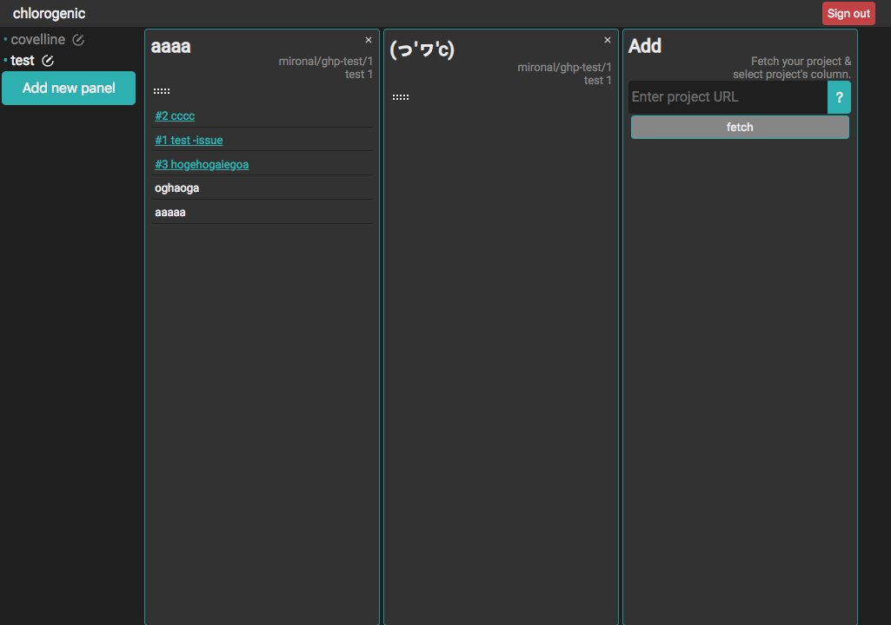

# chlorogenic :coffee:

Let's organize your GitHub projects of multiple repositories.

[https://chlorogenic-2ca86.firebaseapp.com/](https://chlorogenic-2ca86.firebaseapp.com/)

## Aim at...

- Operate project's cards across any projects or repositories.
- Bulk operation on multiple cards

## Technologies (੭•̀ᴗ•̀)

- Front end
    - React + Rematch + Redux
    - styled-components
    - TypeScript
- Back end
    - firebase
    - Graph QL
